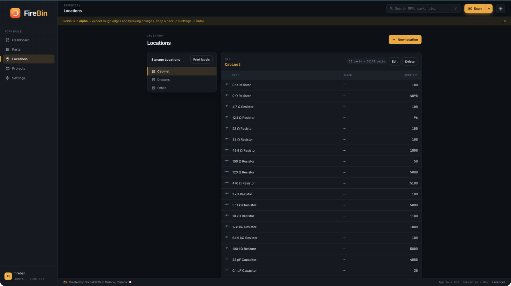
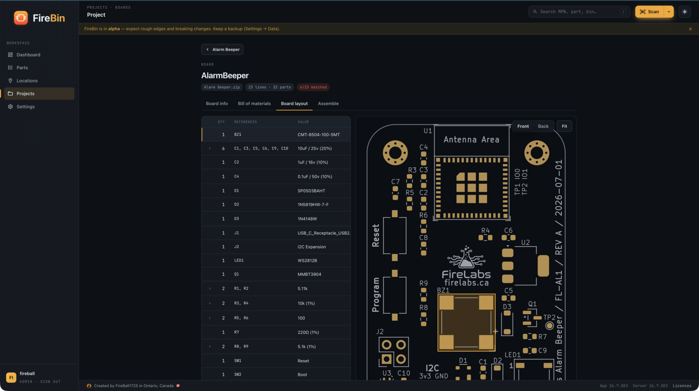
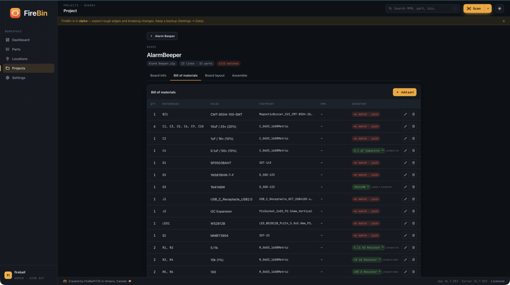
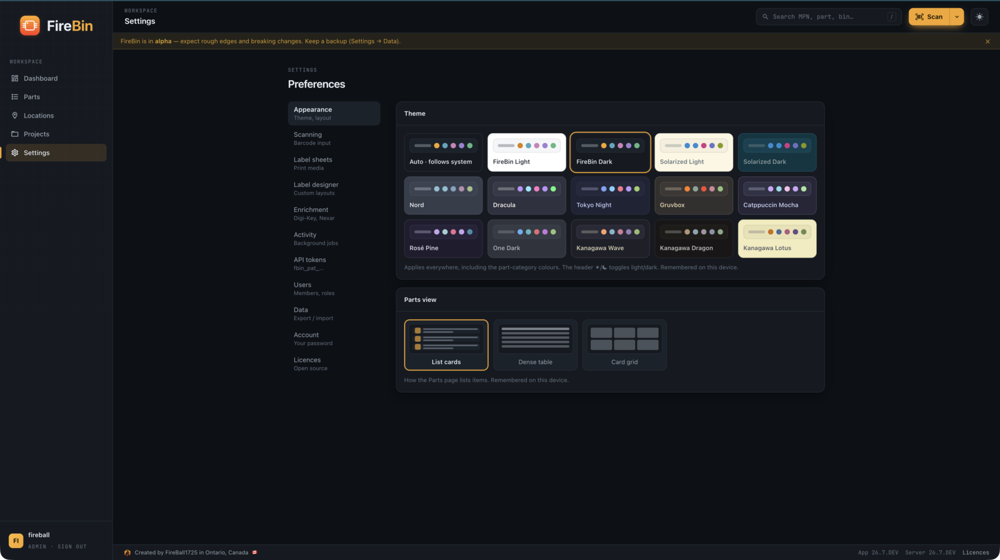
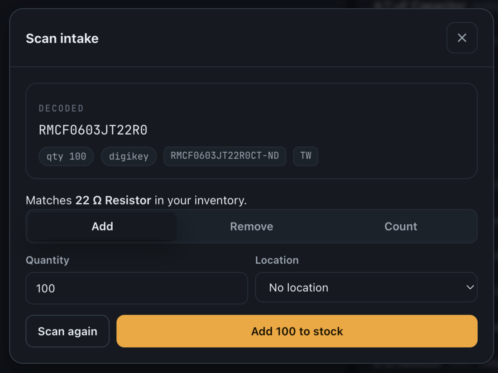
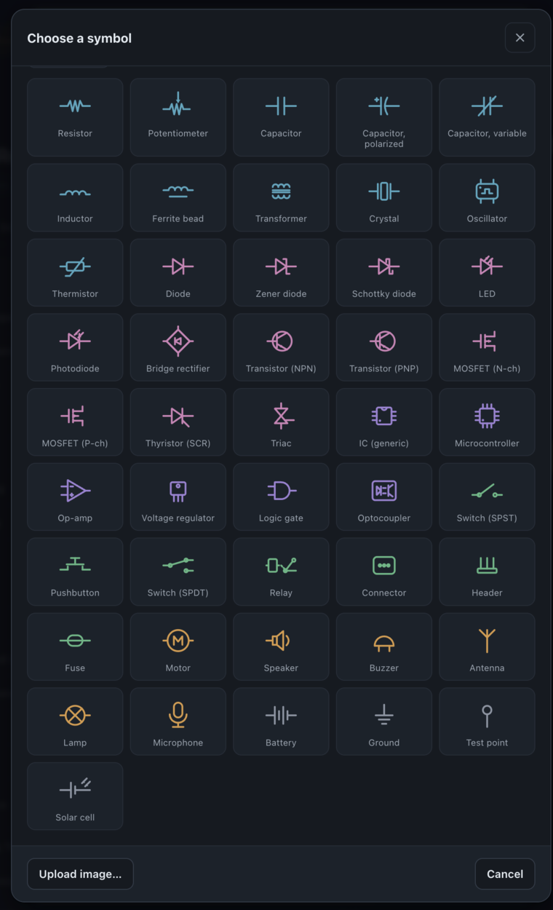

<p align="center">
  
</p>
<h1 align="center">FireBin</h1>
<p align="center">
  <b>Self-hosted electronics parts inventory.</b><br/>
  Scan a distributor bag, and the part enriches itself.
</p>
<p align="center">
  <a href="https://github.com/FireBall1725/firebin-api">API repo</a> ·
  <a href="https://github.com/FireBall1725/firebin-web">Web repo</a> ·
  <a href="https://fireball1725.github.io/firebin-api/">API reference</a> ·
  <a href="ROADMAP.md">Roadmap</a>
</p>

---

FireBin does what PartsBox, InvenTree, and Part-DB do, without the subscription or the cloud lock-in: you run it on your own box, your parts stay in your own Postgres, and adding a part is one barcode scan.

The idea it is built around: parts behave like books. A "1k resistor" is one thing you reach for, but underneath it live many real part numbers that differ by tolerance, package, and brand. FireBin tracks quantity, brand, package, location, and vendor pricing across all of them, and makes adding a part nearly free by reading the Data Matrix on a Digi-Key, Mouser, or LCSC bag so the part enriches itself.

FireBin is in alpha. Expect rough edges, and keep a backup.

## Screenshots

<table>
  <tr>
    <td width="50%"><br/><sub><b>Dashboard</b>: stock summary, low-stock list, recent activity</sub></td>
    <td width="50%"><br/><sub><b>Parts</b>: grouped by name, colour-coded by category</sub></td>
  </tr>
  <tr>
    <td><br/><sub><b>Part detail</b>: parameters and stock adjust in one view</sub></td>
    <td><br/><sub><b>Locations</b>: scannable bins and what they hold</sub></td>
  </tr>
  <tr>
    <td><br/><sub><b>KiCad BOM</b>: board render matched against inventory</sub></td>
    <td><br/><sub><b>BOM</b>: every line matched to a part, shortfalls flagged</sub></td>
  </tr>
  <tr>
    <td><br/><sub><b>Label designer</b>: bin, part, and lot labels</sub></td>
    <td><br/><sub><b>Themes</b>: light and dark, several palettes</sub></td>
  </tr>
  <tr>
    <td valign="top"><br/><sub><b>Scan intake</b>: a scanned bag matched to a part, one tap to book stock</sub></td>
    <td valign="top" align="center"><br/><sub><b>Symbol palette</b>: 46 component symbols</sub></td>
  </tr>
</table>

## The four repos

| Repo | What it is |
|---|---|
| [`firebin`](https://github.com/FireBall1725/firebin) | This repo. Docker Compose, self-host docs, roadmap. |
| [`firebin-api`](https://github.com/FireBall1725/firebin-api) | The Go 1.26 and Postgres 16 backend. REST on `/api/v1`, port 8080. |
| [`firebin-web`](https://github.com/FireBall1725/firebin-web) | The React 19 web client. |
| [`firebin-mcp`](https://github.com/FireBall1725/firebin-mcp) | Model Context Protocol server, port 8090. Query and manage the inventory from Claude, Cursor, or any MCP client. Optional. |

Released images are published to `ghcr.io/fireball1725/firebin-api`, `ghcr.io/fireball1725/firebin-web`, and `ghcr.io/fireball1725/firebin-mcp`. The API reference is published at https://fireball1725.github.io/firebin-api/.

## Deploy it

The production stack is Postgres, the API, the web client, and Caddy for automatic HTTPS. Full instructions, the compose file, the `Caddyfile`, and the `.env` template are in [`deploy/`](deploy/). The short version:

```sh
cd deploy
cp .env.example .env      # set DOMAIN, JWT_SECRET, POSTGRES_PASSWORD
docker compose up -d
```

Open the domain, register the first account (it becomes the admin), and you're running. See [deploy/README.md](deploy/README.md) for HTTPS requirements, enrichment keys, backups, and updating.

## Run it for development

`local/docker-compose.yml` starts Postgres and the API together for local work:

```sh
cd local && docker compose up -d --build
```

Then run the web client from the `firebin-web` repo with `npm run dev`. It proxies `/api` to the API on port 8080.

## Docs

- [docs/enrichment-providers.md](docs/enrichment-providers.md): Digi-Key and Nexar setup.
- [docs/labels.md](docs/labels.md): label templates, sheets, and Brother tape printing.
- [docs/mcp-server.md](docs/mcp-server.md): the planned MCP server.
- [ROADMAP.md](ROADMAP.md): what is not in the alpha yet.

## Contributing

See [CLAUDE.md](CLAUDE.md). To change the backend or the client, open a pull request against `firebin-api` or `firebin-web`; this repo holds deploy files and docs.

## Licence

AGPL-3.0-only. See [LICENSE](LICENSE).

---

<p align="center">
  <a href="https://fireball1725.ca"></a>
</p>
<p align="center">Built by <a href="https://fireball1725.ca">FireBall1725</a> in Ontario, Canada 🇨🇦</p>
